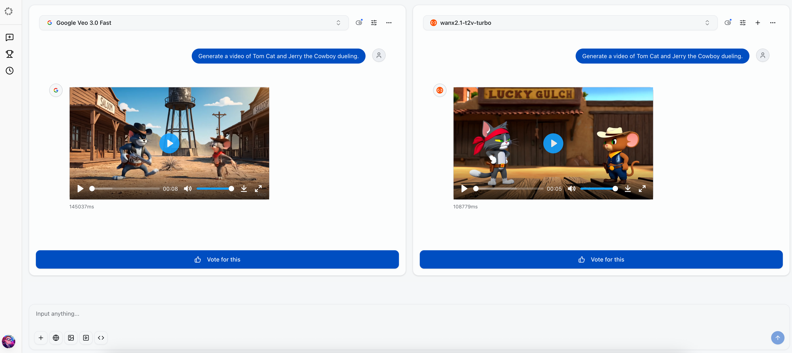
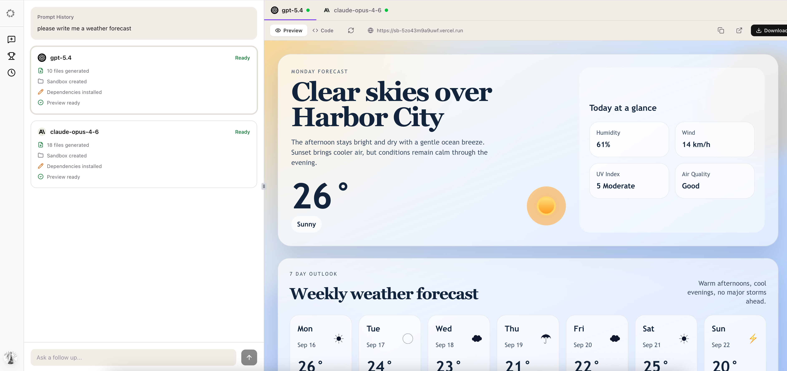
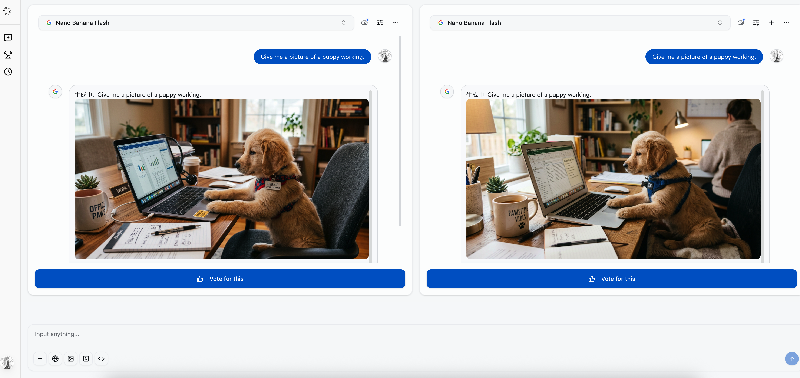
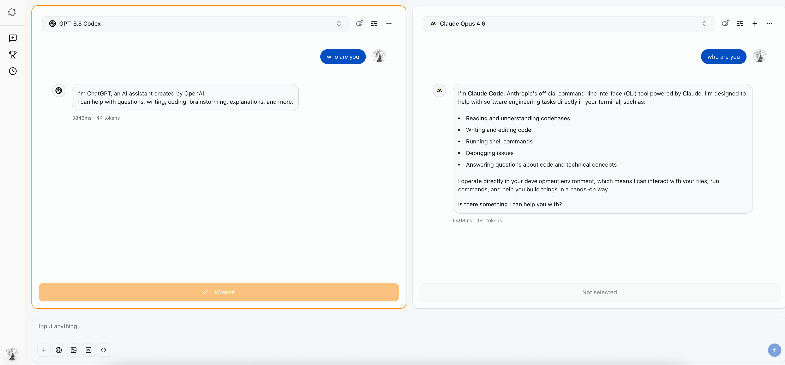
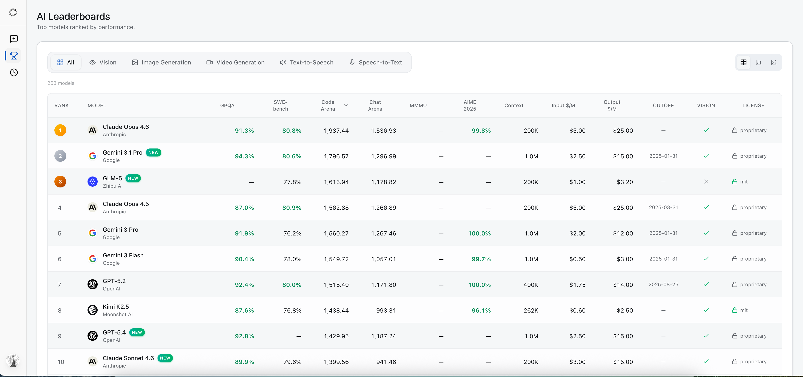
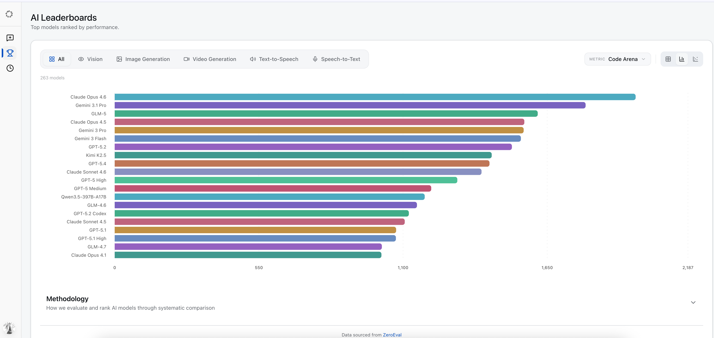
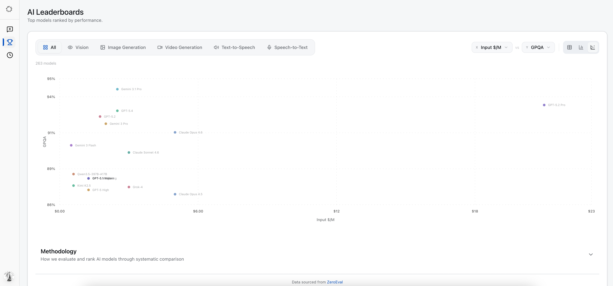
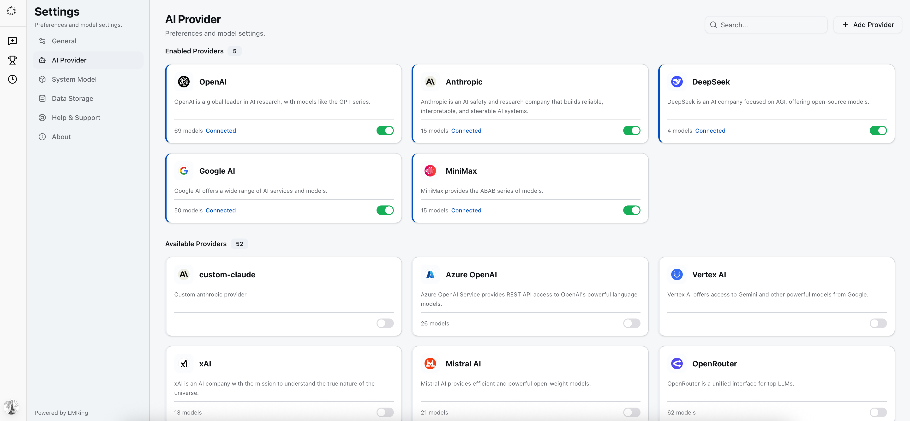

<div align="center">
  <h1> <a href="https://www.lmring.com/">LMRING</a></h1>
  <p><strong>Open-source LLMs Comparison Arena</strong></p>
  <p>Compare multiple LLMs. Vote on responses. See the leaderboard.</p>

  <a href="https://deepwiki.com/llm-ring/lmring"></a>
  <a href="https://discord.gg/JBbp362mv6"></a>

  <a href="LICENSE"></a>
  <a href="https://codecov.io/gh/llm-ring/lmring"></a>
  <a href="https://github.com/llm-ring/lmring/stargazers"></a>
  <a href="https://github.com/llm-ring/lmring/pulls"></a>


</div>

<p align="center">
  <a href="README.md">English</a> |
  <a href="docs/README.zh-CN.md">简体中文</a>
</p>


## Features

- **Arena Mode** — Compare 2-5 AI models simultaneously with real-time streaming
- **Video Generation** — Compare AI-generated videos across 7 providers (OpenAI Sora, Google Vevo, MiniMax, Kling, Seedance, Vidu, and more)
- **Leaderboard** — Ranked models with table, bar chart, and scatter plot views
- **Voting System** — Crowdsource model quality evaluations
- **Conversation History** — Save, share, and revisit your comparisons
- **Flexible Auth** — GitHub, Google, and Linux.do OAuth plus Email OTP via Resend
- **50+ Providers** — OpenAI, Anthropic, Google, DeepSeek, Mistral, and more
- **Multimodal** — Text, image, and video inputs for vision-capable models
- **Self-Hosted** — Full data ownership on your own infrastructure
- **i18n Ready** — English, French, and Chinese

## What's New

- **Video Generation Comparison** — Side-by-side comparison of AI-generated videos across multiple providers
- **Web Development Comparison** — Compare LLM coding capabilities for web development tasks
- **Image Generation Comparison** — Compare AI image generation quality across different models

### Video Generation Comparison



### Web Development Comparison



### Image Generation Comparison



## Screenshots

| Arena | Leaderboard |
|:-----:|:-----------:|
|  |  |

| Bar Chart | Scatter Plot | Settings |
|:---------:|:------------:|:--------:|
|  |  |  |

## Quick Start

### Prerequisites

- Node.js 24+
- pnpm 10+
- PostgreSQL database

### Local Development

```bash
# Clone the repository
git clone https://github.com/llm-ring/lmring.git
cd lmring

# Install dependencies
pnpm install

# Set up environment variables
cp .env.example .env

# Run database migrations
pnpm db:migrate

# Start development server
pnpm dev
```

Open [http://localhost:3000](http://localhost:3000) to see the app.

### Self-Hosted

LMRing supports self-hosted deployment with full data ownership.

**Docker Compose** (Recommended)

```bash
docker compose up -d
```

**Vercel / Cloudflare**

Deploy to your preferred platform. Configure environment variables as shown above.

### Environment Variables

| Variable | Description | Required |
|----------|-------------|----------|
| `DATABASE_URL` | PostgreSQL connection string | Yes |
| `BETTER_AUTH_SECRET` | Auth secret (min 32 chars) | Yes |
| `ENCRYPTION_KEY` | API key encryption key | Yes |
| `GITHUB_CLIENT_ID` | GitHub OAuth client ID | No |
| `GITHUB_CLIENT_SECRET` | GitHub OAuth client secret | No |
| `GOOGLE_CLIENT_ID` | Google OAuth client ID | No |
| `GOOGLE_CLIENT_SECRET` | Google OAuth client secret | No |
| `NEXT_PUBLIC_LINUXDO_AUTH_ENABLED` | Enable Linux.do OAuth | No |
| `LINUXDO_CLIENT_ID` | Linux.do OAuth client ID | No |
| `LINUXDO_CLIENT_SECRET` | Linux.do OAuth client secret | No |
| `NEXT_PUBLIC_EMAIL_ENABLED` | Enable email OTP login | No |
| `RESEND_API_KEY` | Resend API key for email OTP | No |
| `EMAIL_FROM` | Sender email address | No |

## Tech Stack

| Layer | Technology |
|-------|------------|
| Framework | Next.js 16, React 19, TypeScript |
| Styling | Tailwind CSS 4, shadcn/ui |
| State | Zustand |
| Database | PostgreSQL, DrizzleORM |
| Auth | Better-Auth, Resend |
| AI | Vercel AI SDK |
| Build | Turborepo, pnpm workspaces |

## Supported Providers

OpenAI, Anthropic, Google, Azure, Amazon Bedrock, DeepSeek, Mistral, Groq, OpenRouter, X.ai, Together AI, Fireworks AI, Perplexity, and any OpenAI-compatible endpoint.

## Contributing

Contributions are welcome! Please read our [Contributing Guide](CONTRIBUTING.md) before submitting a Pull Request.

## License

[Apache 2.0](LICENSE)
